# AllEat : 식단 식비 통합 자동관리 서비스

## 🚩 목차

1. [기획 배경](#✨-기획-배경)
2. [서비스 소개](#✨-서비스-소개)
3. [화면 정의서](#✨-화면-정의서) 
4. [기능 소개](#✨-기능-소개)
5. [기술 스택](#✨-기술-스택)
6. [프로젝트 일정 및 기타 산출물](#✨-프로젝트-일정-및-기타-산출물)
7. [팀원 소개 및 소감](#✨-팀원-소개-및-소감)

## ✨ 기획 배경

### 개요

- 거래내역을 기반으로 수기로만 작성됐던 일반 식단 및 식비 서비스를 한번에 손쉽게 관리
- 2024 소비트렌드를 보면 자기관리가 열풍 및 건강식단 관심도 증가
- 건강식단을 유지하는 과정에서 식비 관리는 쉽지가 않다는 걸 확인할 수 있다.

### 기존 어플 조사 및 설문조사

0. 설문조사 시행
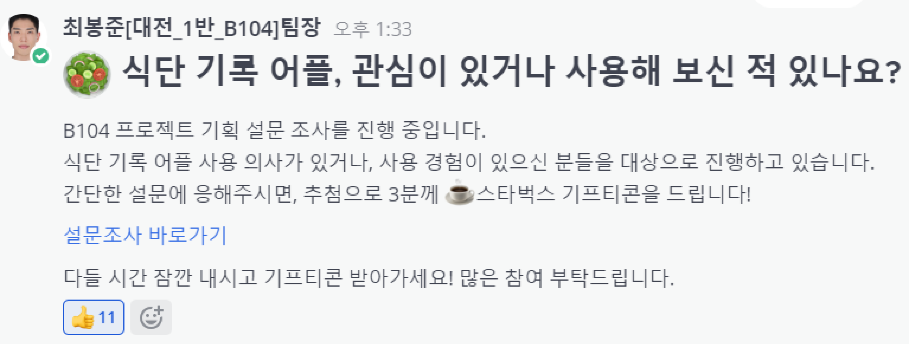

1. 기존 어플의 이런 점이 불편했다.
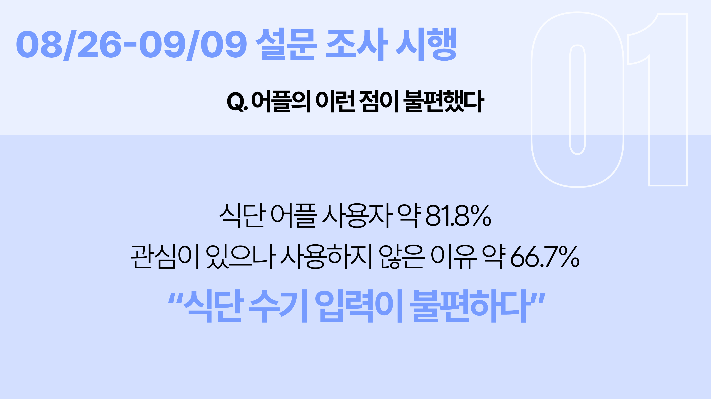

2. 이런 기능이 추가/개선되면 사용할 의향이 있다.

### 서비스 목표

- 식단 수기 입력이 불편하다 + 식비 동시 관리 기능이 있으면 좋겠다.
    > **거래내역을 추적하여 사용자 식단 및 식비 기록 자동화**
- 사등을 통한 식단 자동 기록이 있으면 좋겠다.
    > **AI를 통해 사진 분석 및 식단 기록**

## ✨ 서비스 소개

### 페르소나

- 건강한 식단을 챙기지만 식비를 효율적이게 관리를 못하는 사람
- 식비를 줄이기는 하지만 충분한 영양소를 보충하지 못하는 사람
- 식단 및 식비 수기 작성 떄문에 어플 사용이 불편한 사람

### 기대효과

- **거래내역을 통한 등록**
  - 수기등록 최소화를 통한 유저 편의성 증가
  
- **사진 촬영으로 식단 등록**  
  - 이름 모를 메뉴 등 등록 시 애매한 정보를 AI를 통해 객관적으로 등록
  - 수기 등록 또한 최소화

- **식단과 식비를 한번에 관리**
  - 동시 기록 및 관리를 통한 효율적인 레포트 제공

## ✨ 화면 정의서
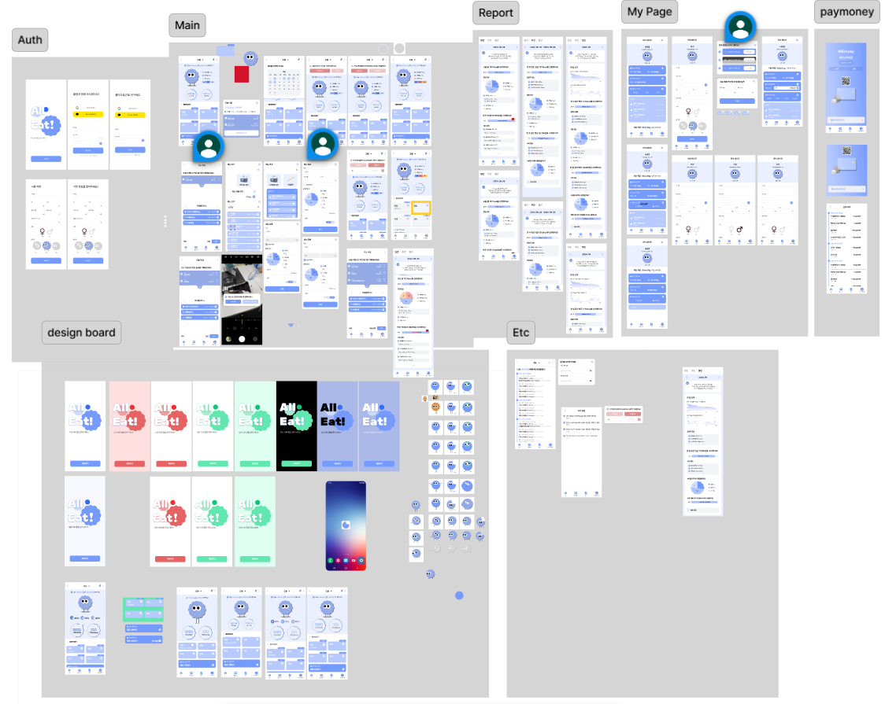

## ✨ 기능 소개

- **거래 내역 기반 기록**
  - 사용자가 '페이머니'에 식비를 충전한 후 발생하는 거래 내역을 분석하여 식비와 식단 정보를 자동으로 기록합니다. 사용자는 충전식으로 식비를 관리하며, 페이머니를 통해 이루어진 모든 거래가 자동으로 기록되기 때문에 식비 관리가 더욱 간편해집니다.
  - 각 거래 내역은 사용된 메뉴와 식비를 연계하여 기록되며, 별도의 수기 입력 없이도 편리하게 관리할 수 있습니다.

- **AI를 통한 사진 촬영 기록**
  - Yolo v10 모델을 활용하여 사용자가 직접 식단을 사진으로 찍으면, AI가 이를 분석해 자동으로 식단을 등록합니다. 사용자가 직접 메뉴를 입력할 필요 없이, AI가 메뉴와 칼로리 정보를 자동으로 추출하여 편리하게 기록됩니다.
  - 이름이 불확실하거나 생소한 메뉴도 AI가 인식하여 정확하게 기록할 수 있도록 지원합니다.

- **식단 식비 추척을 통한 레포트**
  - 기록된 식단과 식비를 바탕으로 일간, 주간, 월간 레포트를 자동으로 생성하여 사용자에게 제공합니다. 각 레포트는 섭취한 칼로리, 영양소 비율, 지출 내역 등을 시각화하여 쉽게 확인할 수 있으며, 사용자는 이를 바탕으로 식습관과 소비 패턴을 개선할 수 있습니다.
  - 식단과 식비의 동시 분석: 서비스는 식비와 영양소의 균형을 동시에 분석하여, 사용자가 식비는 잘 지켰으나 영양소를 충분히 섭취하지 못했을 경우나, 반대로 영양소는 충분히 섭취했으나 식비를 초과한 경우를 알려줍니다. 이를 통해 사용자는 식습관과 지출 관리 모두에서 균형을 잡을 수 있는 맞춤형 피드백을 받습니다.

## ✨ 기술 스택

- **프론트엔드** : React-Native, TypeScript, Redux-Toolkit, Tailwindcss
- **백엔드** : Spring Boot, Spring Security, JWT, Oauth 2.0, Fast-api
- **인프라** : Docker, Nginx, Jenkins, MySQL, Certbot, EC2
- **특화 기술** : YOLOv10, OpenAI
- **이슈 관리** : JIRA, Mattermost, Notion, Gitlab

### 아키텍처 설계도

## ✨ 프로젝트 일정 및 기타 산출물

### 프로젝트 일정

**전체 일정** : 2024.08.26 ~ 2024.10.11(7주)

- **기획** : 2024.08.26 ~ 2024.09.06(2주)
- **개발** : 2024.09.09 ~ 2024.10.11(5주)

### 플로우 차트
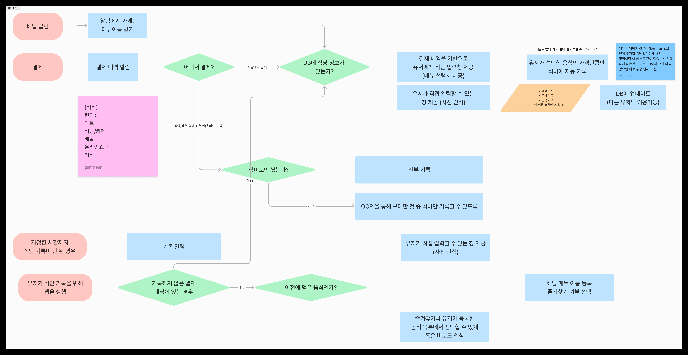

### 시퀀스 다이어그램
회원가입|배달앱 결제
-----|-----
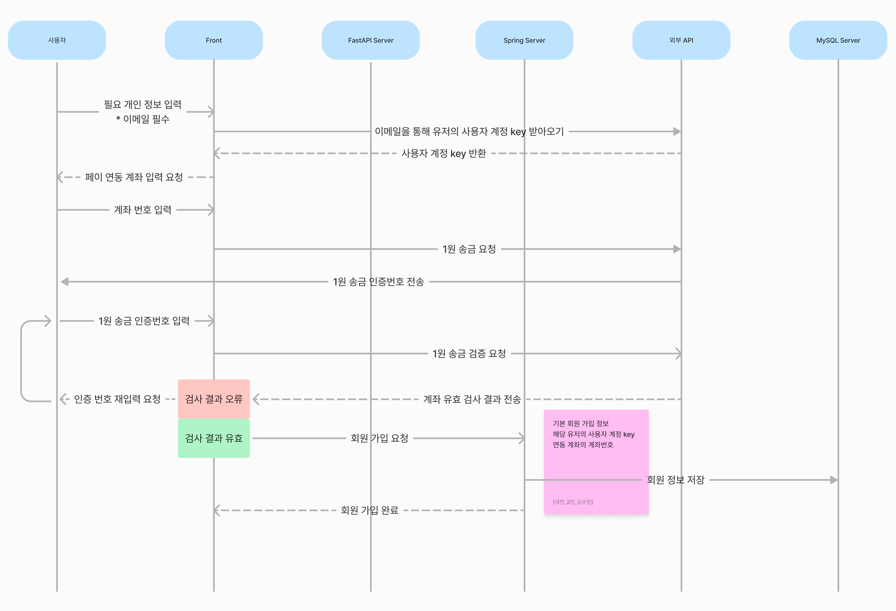|

마트 결제|식당 결제
-----|-----
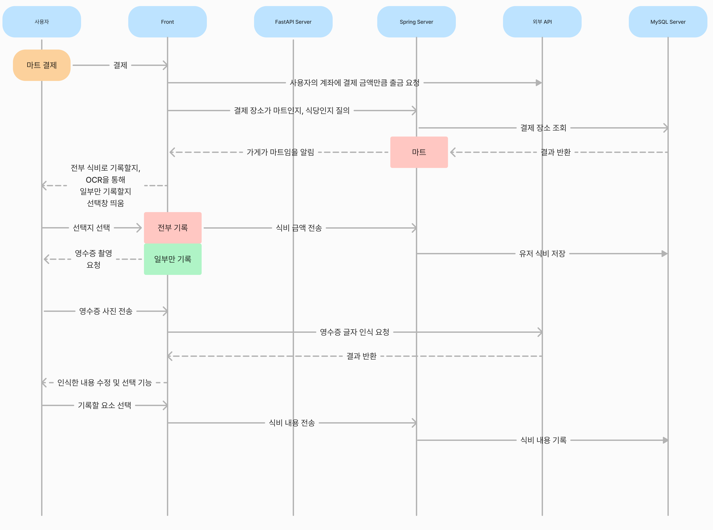|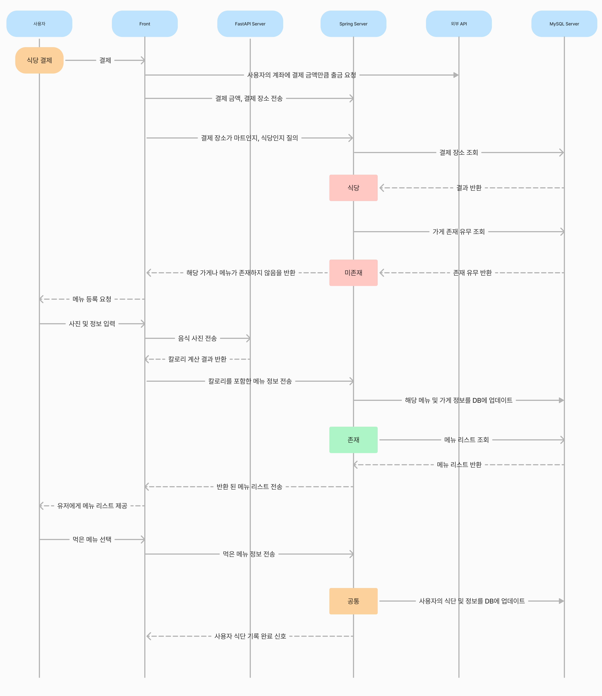

### ERD
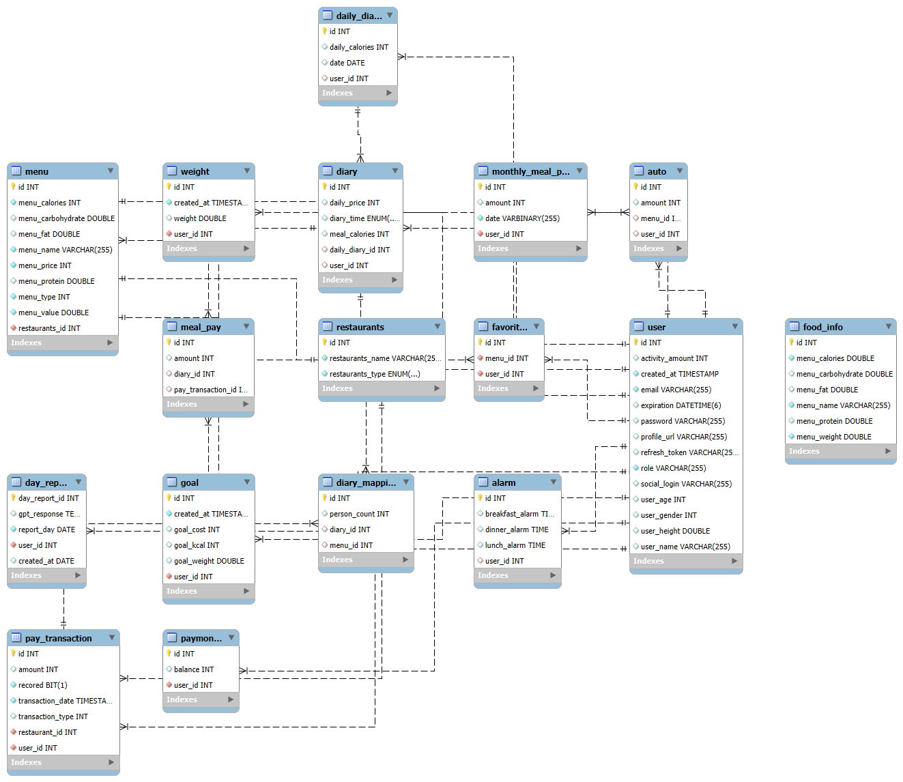

### API 명세서
- url : https://ring-barracuda-ca0.notion.site/API-fb4d9e04b25e4ef3a6ddb387e7ef43be
.png)
.png)
.png)
.png)
.png)
### 화면 구성
초기 페이지|로그인 페이지|회원 가입|메인 페이지
-----|-----|-----|-----
||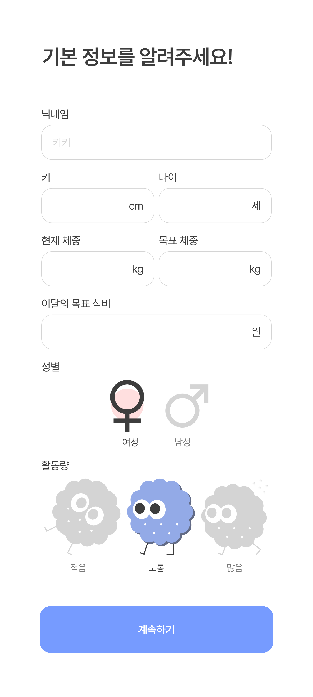|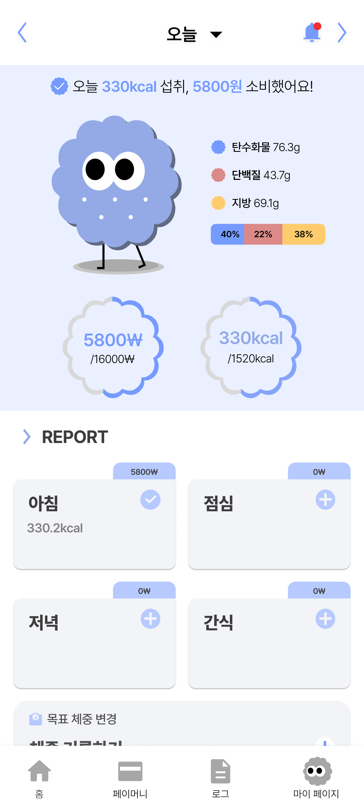

식단 등록|메뉴 등록|사진 등록|수기 등록
-----|-----|-----|-----
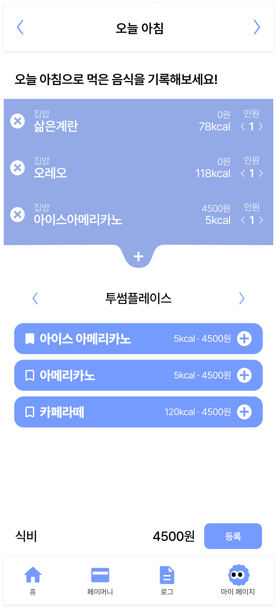|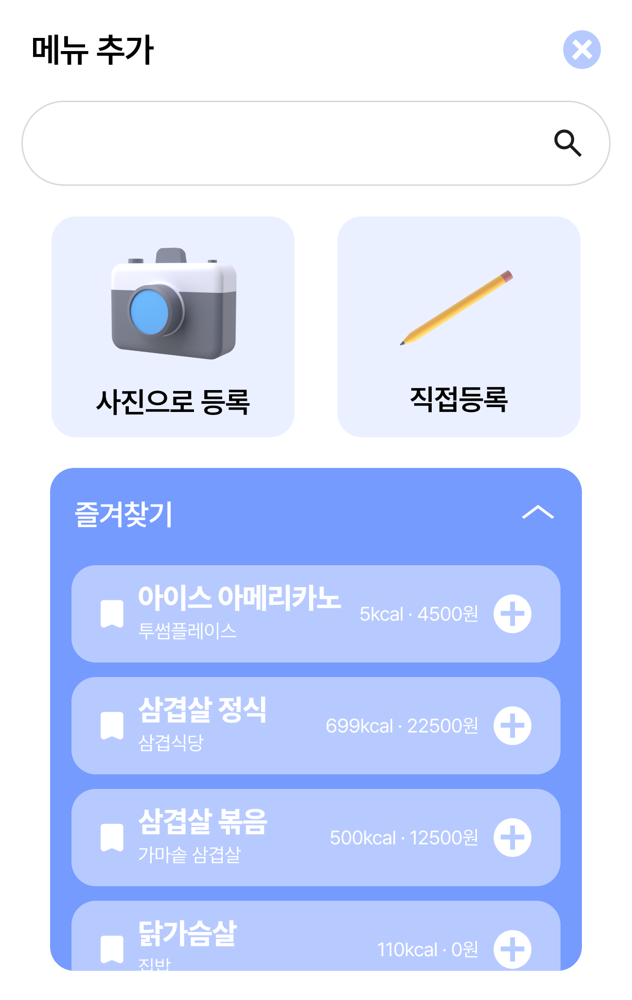|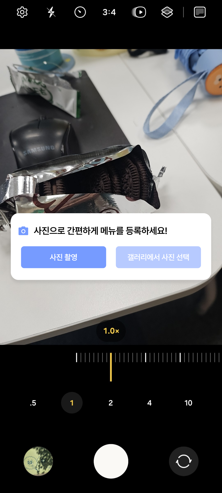|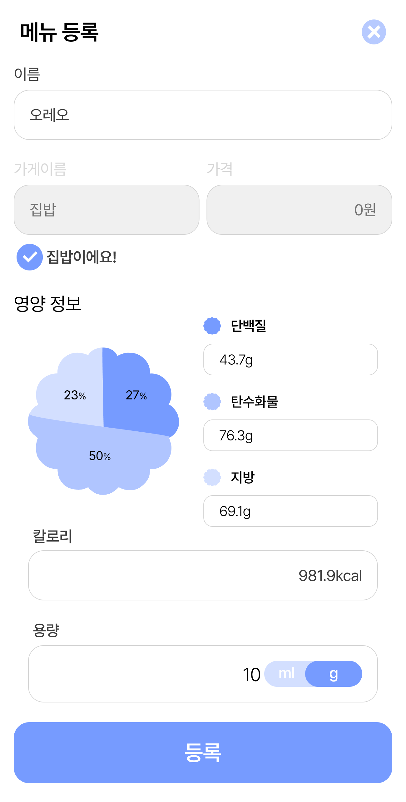

일간 레포트|주간 레포트|월간 레포트|식비 내역
-----|-----|-----|-----
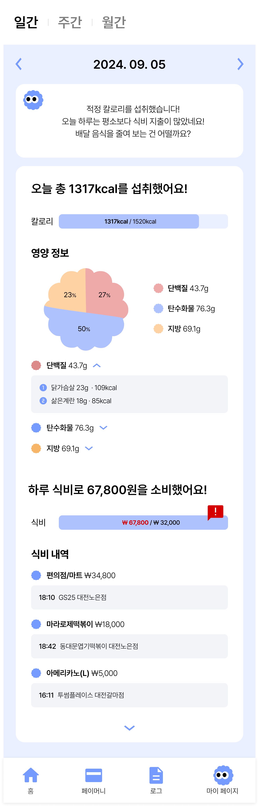|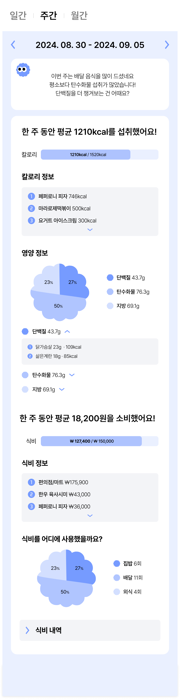|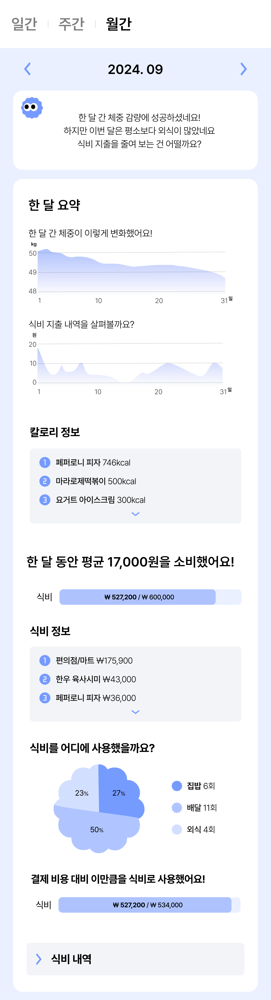|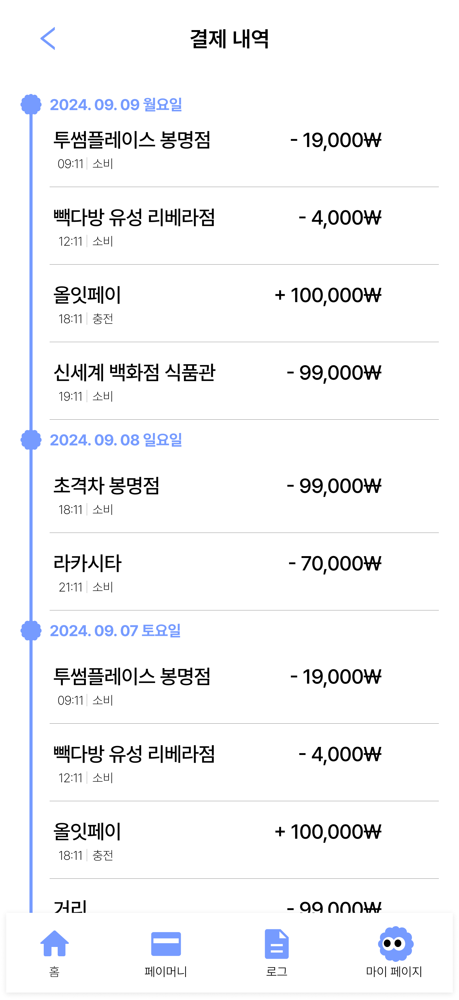

페이 머니|마이 페이지|내 정보 수정|---
-----|-----|-----|-----
|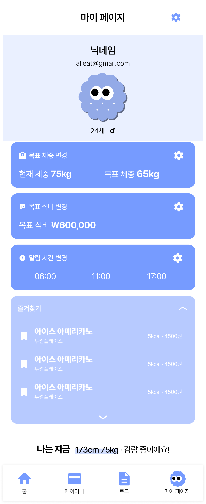|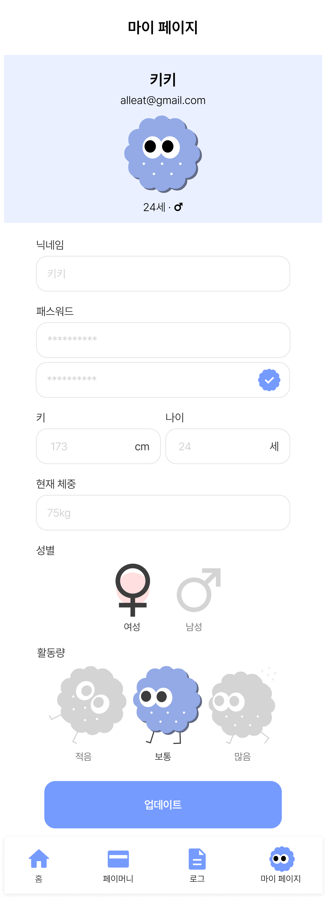|---
## ✨ 팀원 소개 및 소감

